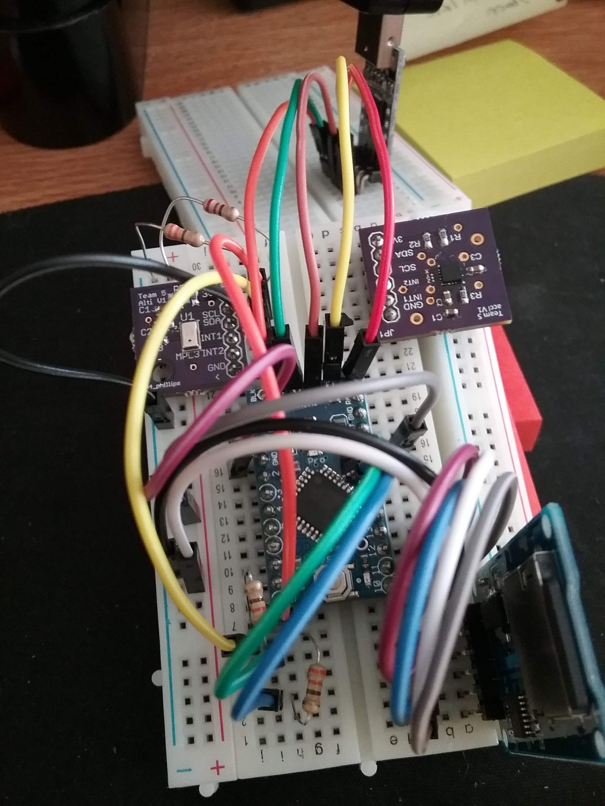

# ZacharySafranPCBFiles

The purpose of this repository is to showcase the PCB designs that I have worked with and those that I have created myself.

The folder 1_AntennaBrd_ANDESITE contains the .sch and .brd files for the antenna mounting PCB that I mention in my resume. I worked on designing this PCB with a research engineer in my lab. My main contributions to the design were to make sure that the mounting holes for the antennas, and sun sensor were in the right spot by referencing a CAD model of the satellite and to use MATLAB simulations to get an idea of how the shape of the PCB's ground plane would affect the monopole/dipole antennas's impedance.

The majority of the time I worked in the Space Technology Lab during the 2017 summer was spent on assembling and testing PCBs for the pico-satellite nodes that make up the ANDESITE satellite swarm. The .sch and .brd files for these PCBs are in the 2_Node_PCB_ANDESITE and 3_Node_SolarPanels_ANDESITE folders respectively. The main Node_PCB is a 4 layer PCB and the  Node_SolarPanels PCB is a 2 layer PCB. While I was not involved with designing either of these PCBs, working with them exposed me to more complex PCB layout and design techniques like using Restrict layer polygons to prevent ground plane copper from being laid in a specific area.

The only PCBs that I have designed and ordered completely by myself were two breakout boards for an altimeter sensor and an accelerometer sensor. I designed the altimeter PCB in EAGLE and the accelerometer PCB in Altium.

# Photos

## Satellite Pictures

A few of the full assembled satellite nodes.
&nbsp;

A partially assembled node satellite circuit board.
&nbsp;

## Testing Sensors Photo

My altimeter breakout board (top left) and my accelerometer breakout board (top right) can be see being test in this picture.
